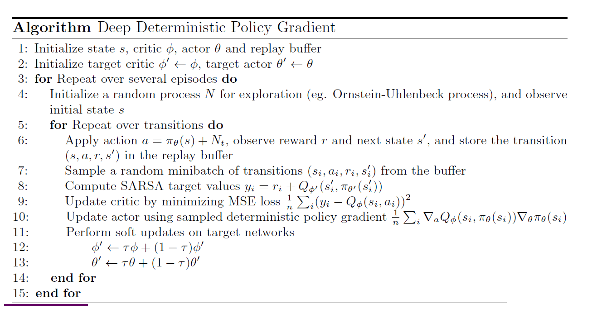

# Deep Deterministic Policy Gradient

#### Table of Contents

- [Introduction](#introduction)
- [Stationary Distribution of Markov Chain](#stationary-distribution-of-markov-chain)
- [Objective Function Formulation](#objective-function-formulation)
- [Stochastic Policy Gradient Theorem](#stochastic-policy-gradient-theorem)
- [DDPG Algorithm - Key Ideas](#ddpg-algorithm-key-ideas)
- [DDPG Algorithm](#ddpg-algorithm)

## Introduction
So far, in the policy gradient algorithms, we were looking at stochastic optimal policy $\pi_\theta$ in a continuous state and action spaces setting. However, there are scenarios where we want to have a deterministic policy in a continuous state and action spaces setting. We considered the following "start-state" objective function $J(\theta)$ for our previous algorithms:

$$
\begin{align}
J_1(\theta) = V^{\pi_{\theta}}(s_0) = \mathbb{E}_{\tau \sim \pi_{\theta}} \left[ \sum_{t=0}^{\infty} \gamma^t r_{t+1} \, | \, S_0 = s_0 \right] \tag{1}
\end{align}
$$

Then, we were looking for a policy $\pi^*_{\theta}$ in the space of stochastic policies by finding that set of $\theta$ that maximizes $J(\theta)$. That is, we used the value of the start state as the objective function. Are there any alternate objective function that we can consider?

## Stationary Distribution of Markov Chain
Given an MDP $< \mathcal{M} = \mathcal{S}, \mathcal{A}, \mathcal{P}, \mathcal{R}, \gamma  >$ and a policy $\pi_{\theta}: \mathcal{S} \rightarrow \mathcal{A}$, we have an induced MRP $<\mathcal{S}, \mathcal{P}^{\pi_{\theta}}, \mathcal{R}^{\pi_{\theta}}, \gamma>$. This even induces a Markov Chain $<\mathcal{S}, \mathcal{P}^{\pi_{\theta}}>$ over the state space $\mathcal{S}$ with transition matrix $\mathcal{P}^{\pi_{\theta}}$ as follows:

$$
\mathcal{P}^{\pi_{\theta}}_{ss'} = \sum_{a \in \mathcal{A}} \pi_{\theta}(a|s) \mathcal{P}_{ss'}^a
$$

* The probability of taking action $a$ comes from the policy $\pi_{\theta}$.
* The probability of transitioning to state $s'$ after taking action $a$ in state $s$ comes from the transition dynamics $\mathcal{P}_{ss'}^a$ of the MDP.

Imagine that you can travel along the Markov chain’s states forever (by following the policy $\pi_{\theta}$), and eventually, as the time progresses, the probability of reaching state $s$ starting from $s_0$ (start-state) becomes unchanged and is given by

$$
d^{\pi_{\theta}}(s) = \lim_{t \to \infty} \mathbb{P}(S_t = s | S_0 = s_0, \pi_{\theta})
$$

This represents the probability of reaching state $s$ starting from $s_0$ in $t$ time steps while following policy $\pi_{\theta}$. And we let this $t$ go to $\infty$. The proportion of time the agent visits state $s$ over a very long time horizon (as $t \to \infty $) is exactly equal to this stationary probability. Thus, $d^{\pi_{\theta}}(s)$ represents the long-term visitation frequency of state $s$ when following policy $\pi_{\theta}$.

The entity $d^{\pi_{\theta}}(s)$ is called the limiting or stationary distribution of the Markov Chain induced by policy $\pi_{\theta}$. This stationary distribution is independent of the start state $s_0$. Existence of such unique stationary distribution can be guaranteed if the Markov Chain is ergodic, that is, irreducible (it is possible to get to any state from any state) and aperiodic (the system does not get trapped in cycles).

## Objective Function Formulation
Using this stationary distribution $d^{\pi_{\theta}}(s)$, we can formulate an alternate objective function as follows. In Equation <a href="#eq:eq1">(1)</a>, we were considering only the value of the start state $s_0$ as the objective function. But what if we want to consider the value of other states also?

One of such objective formulations is called as **Average Value** objective function, which is defined as follows:

$$
\begin{align*}
J_{avV}(\theta) & = \mathbb{E}_{s \sim d^{\pi_{\theta}}(s)} \left[ V^{\pi_{\theta}}(s) \right] \\
& = \sum_{s \in \mathcal{S}} d^{\pi_{\theta}}(s) V^{\pi_{\theta}}(s) \\
& = \sum_{s \in \mathcal{S}} d^{\pi_{\theta}}(s) \sum_{a \in \mathcal{A}} \pi_{\theta}(a|s) Q^{\pi_{\theta}}(s,a)
\end{align*}
$$

In this new objective function, we are considering the values of all the states in the state space $\mathcal{S}$ weighted by their stationary distribution $d^{\pi_{\theta}}(s)$. That is, we are considering the long-term visitation frequencies of the states while following policy $\pi_{\theta}$. The states that are visited more often will have a higher weight in the objective function. Then, our goal is to find a policy $\pi^*_{\theta}$ in the space of stochastic policies by finding that set of $\theta$ that maximizes $J_{avV}(\theta)$.

* With the objective function $J_1(\theta)$, we were focusing on maximizing the expected return starting from the start state $s_0$.
* With the objective function $J_{avV}(\theta)$, we are focusing on maximizing the expected return across all states, weighted by how frequently those states are visited under the policy $\pi_{\theta}$. In other words, we want to visit those states more often in the Markov chain where $V^{\pi_{\theta}}(s)$ is high. We are looking for a policy $\pi_{\theta}$ that take us through such states.

In short, average of $V^{\pi_{\theta}}(s)$ is computed using $d^{\pi_{\theta}}(s) $ as weights. For episodic sequence starting from $s_0$, the average is computed from the tail of the sequence.

In the infinite horizon setting with $\gamma < 1$ and with the objective function <a href="#eq:eq1">(1)</a>, we are not concerned about the far distant rewards; the distant rewards become insignificant. But what if we want to care about the distant rewards beyond the capacity provided by the discount factor $\gamma$?

There is another similar objective function formulation called **Average Reward** objective function. The average reward objective function for a policy $\pi_{\theta}$, is defined as

$$
J_{avR}(\theta) = \lim_{T \to \infty} \frac{1}{T} \mathbb{E}_{\tau \sim \pi_{\theta}} \left[ \sum_{t=0}^{T-1} r_{t+1} \right]
$$

This gives average reward per time step. Under the unichain condition (which implies the Markov chain is ergodic), the system eventually reaches a state where the probability of being in any specific state becomes constant and independent of the initial starting state. Because the average reward is state-independent in the limit (the long-term average reward the agent receives does not depend on its initial starting state), the complex time-dependent expectation of future rewards can be re-expressed as a simple expected value over this fixed long-term distribution. 

$$
\lim_{T \to \infty} \frac{1}{T} \mathbb{E}_{\tau \sim \pi_{\theta}} \left[ \sum_{t=0}^{T-1} r_{t+1} \right] = \mathbb{E}_{s \sim d^{\pi_{\theta}}(s), a \sim \pi_{\theta}(a|s)} \left[ R(s,a) \right] 
$$

It calculates the expected immediate reward at a single, arbitrary time step after the system has reached its long-run steady state. Therefore, the final simplified expression:

$$
J_{avR}(\theta) = \sum_{s \in \mathcal{S}} d^{\pi_{\theta}}(s) \sum_{a \in \mathcal{A}} \pi_{\theta}(a|s) R(s,a)
$$

In this new objective function, we are considering the immediate rewards of all the states and actions weighted by their stationary distribution $d^{\pi_{\theta}}(s)$ and the policy $\pi_{\theta}(a|s)$. The average reward objective function is typically used for continuing (episodic or infinite-horizon) tasks where the total cumulative reward might be unbounded. This objective function aims to maximize the long-term average reward per time step while following policy $\pi_{\theta}$.

Depending upon the problem setting, we can choose any of these objective functions: $J_1(\theta)$, $J_{avV}(\theta)$, or $J_{avR}(\theta)$ to find the optimal policy $\pi^*_{\theta}$.

## Stochastic Policy Gradient Theorem
For any differentiable policy $\pi_{\theta}$, for any of the policy objective functions $J(\theta) = J_1(\theta), \frac{1}{1-\gamma} J_{avV}(\theta), J_{avR}(\theta)$, the gradient estimate of the objective function with respect to the parameter $\theta$, under some conditions, is always given by

$$
\begin{align*}
\nabla_{\theta} J(\theta) = \mathbb{E}_{\tau \sim \pi_{\theta}} \left[ \sum_{t=0}^\infty \biggl\{ \nabla_{\theta} \log \pi_{\theta}(a_t \, | \, s_t) \cdot  Q^{\pi_{\theta}}(s_t, a_t) \biggr\}  \right] \\
\end{align*}
$$

* $\pi_{\theta}(a_t \, | \, s_t)$ is the actor and $Q^{\pi_{\theta}}(s_t, a_t)$ is the critic.

NOTE: For $J_{avR}(\theta)$, we may have to scale it appropriately. The theorem has the word stochastic because the policy $\pi_{\theta}$ is stochastic.

## DPG Algorithm Key Ideas
Thus far, we considered the policy function $\pi(\cdot \ | \, s)$ as a probability distribution over actions space and thus considered stochastic policies. Deterministic policy gradient algorithms (DPG) instead models the policy as a
deterministic decision: $a = \pi(s)$. The policy network will output the action itself (where the action space is continuous).

The (stochastic) policy gradient algorithms we saw thus far including A2C, A3C, etc. are on-policy algorithms because they learn a policy using the samples generated from the same policy. DDPG (Deep DPG) algorithm can be thought of as an off-policy actor-critic algorithm, and can also be thought of as DQN for continuous action space setting.

The DPG algorithm interleaves between learning optimal action-value function $Q^*(s,a)$ and learning
optimal policy $\pi^*(s)$. We use Bellman optimality equation to learn $Q^*(s,a)$ and policy gradients to learn $\pi^*(s)$. The optimal action-value function in the DQN setting is learnt using the following function:

$$
L(\phi_i) = \mathbb{E}_{(s,a,r,s') \in D} \left[Q_{\phi_i}(s,a) - r - \gamma \max_{a'} Q_{\phi'_i}(s',a') \right]^2
$$

As the target involves a max operator, we can work with this equation only in a discrete action space setting. So, in the DDPG setting, we calculate the max over actions using the policy network $\pi_{\theta}$ as follows:

$$
L(\phi_i) = \mathbb{E}_{(s,a,r,s') \in D} \left[Q_{\phi_i}(s,a) - r - \gamma Q_{\phi'_i}(s', \pi_{\theta}(s')) \right]^2 \tag{2}
$$

In the target expression, instead of taking the best action, we now use the action suggested by the policy $\pi_{\theta}$. This is analogous to the SARSA control algorithm update step. Note that the expectation is over the distribution of samples in the replay buffer.

* We use this loss function to update the parameters $\phi$ of the main $Q$ network. This gradient descent step updates the main network to better approximate the action-value function for a given policy, that is, $Q^{\pi_{\theta}}$.

But if our policy is $\pi_*$, then the update step updates the main network to better approximate the optimal action-value function, $Q_*$. So, in the training process, we simultaneously make updates to $\pi_{\theta}$ as well.

The policy is learnt by recognizing that we are looking for a deterministic policy $\pi_{\theta}(s)$ that gives an action $a$ that maximizes $Q_{\phi}(s,a)$. This $Q_{\phi}$ will be maximum for the best action, and the best action comes when $\pi_{\theta}$ is the optimal policy. Thus, we can formulate the objective function for the policy network as follows.

$$
\begin{align*}
J(\theta) & = \mathbb{E}_{s \sim D} \left[ Q_{\phi}(s, \pi_{\theta}(s)) \right] \\
& = \mathbb{E}_{s \sim D} \left[ Q_{\phi}(s, a) \right]
\end{align*} \tag{3}
$$

* $s$ is sampled from the replay buffer $D$ and doesn't depend on $\theta$.
* The Q-network parameters $\phi$ are considered fixed while updating the policy parameters $\theta$.
* The action $a$ inside $Q_{\phi}(s, a)$ is the output of the deterministic policy $a = \pi_{\theta}(s)$.

We try to find the parameters $\theta$ that maximizes this objective function. The gradient of this objective function with respect to $\theta$ is given as follows. We differentiate inside the expectation because the expectation is over a distribution independent of $\theta$.

$$
\nabla_{\theta} J(\theta) = \mathbb{E}_{s \sim D} \left[ \nabla_{\theta} Q_{\phi}(s, \pi_{\theta}(s))  \right]
$$

The inner term is a composition:

* Outer function: $Q_{\phi}(s,a)$
* Inner function: $a=\pi_{\theta}(s)$

On applying the chain rule, we get:

$$
\nabla_{\theta} J(\theta) = \mathbb{E}_{s \sim D} \left[ \nabla_{\theta} \pi_{\theta}(s) \nabla_{a} Q_{\phi}(s,a) |_{a = \pi_{\theta}(s)} \right]
$$

This is known as the deterministic policy gradient. We perform gradient ascent to update the policy parameters $\theta$ in the direction of this gradient.

* $\nabla_{a} Q_{\phi}(s,a)$: how much the Q-value changes when we change the action a little.
* $\nabla_{\theta} \pi_{\theta}(s)$: how much the action changes when we change the policy parameters.
* Multiplying them gives how a change in policy parameters affects the Q-value, via its effect on the action.

Because the policy that is being learnt is deterministic, to make DDPG policies explore better, we add noise to their actions at training time. Typically, Ornstein-Uhlenbeck (OU) noise or zero-mean Gaussian noise is used for this purpose.

## DDPG Algorithm
The DDPG algorithm is summarized in the figure below. It uses experience replay and target networks just like DQN. The main difference is that there are two networks: the Q-network (critic) and the policy network (actor). The Q-network is updated using the loss function in Equation <a href="#eq:eq2">(2)</a>, and the policy network is updated using the deterministic policy gradient derived from Equation <a href="#eq:eq3">(3)</a>. There are two target networks as well for stability, which are updated slowly using polyak averaging towards the main networks.

The critic network here is the Q-network that estimates the action-value function, and the actor network is the policy network that outputs the action given a state. Thus, DDPG is an actor-critic algorithm with deterministic policy. Note that the actor network is V-network in the stochastic policy gradient algorithms such as REINFORCE, A2C, A3C, etc.

* In step 1, we initialize a state $s$ from the environment.
* In step 4, we initialize a zero-mean noise process $N$ for action exploration.
* In step 6, we select action $a_t$ by adding noise to the action suggested by the policy network $\pi_{\theta}(s)$. As the action space is continuous, we can add noise to the suggested action.
* In step 8, we compute the target value $y_i$ using the target networks.
* In step 9, we update the critic network by minimizing the loss between the predicted Q-value and the target value.
* In step 10, we update the actor network using the deterministic policy gradient.
* In steps 12 and 13, we update the target networks for both critic and actor using polyak averaging.

DDPG is an online, off-policy, model-free reinforcement learning algorithm suitable for continuous action spaces. It combines the benefits of DQN and policy gradient methods, making it effective for a variety of control tasks.

The idea of deterministic policy gradient has connections to the stochastic policy gradient setting in the limiting case. As the stochastic policy becomes more deterministic, the stochastic policy gradient (stated in stochastic policy gradient theorem) converges to the deterministic policy gradient.