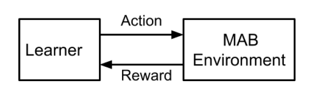

# Multi-Arm Bandits

#### Table of Contents

- [Introduction](#introduction)
- [Multi-arm Bandit Problem](#multi-arm-bandit-problem)
- [Applications of Bandit Algorithms](#applications-of-bandit-algorithms)
- [Multi-Arm Bandit Formulation](#multi-arm-bandit-formulation)
    - [Regret Minimization](#regret-minimization)
    - [Regret Minimization - Alternative Formulation](#regret-minimization---alternative-formulation)

## Introduction
In the Q-learning or DQN settings, we had an $\epsilon$-greedy with $\epsilon$ decay exploration technique to balance exploration and exploitation. The multi-arm bandit theory help us develop more sophisticated exploration strategies to tackle this exploration-exploitation trade-off. Note "bandits" refer to robbers.

And, multi-arm bandit algorithms are heavily used in online learning.

## Multi-arm Bandit Problem

Multi-arm bandit problems are a class of sequential decision-making problems where an agent must choose between multiple options (or "arms"). Each arm provides a reward drawn from a probability distribution specific to that arm, and the agent must balance exploration (trying out different arms to learn their reward distributions) and exploitation (choosing the arm that currently seems best). In such a setting, there are the following two problems:

* **Learning problem**: which arm is the best? - best-arm identification problem. We need to learn the best arm given some budget or trials. Here we don't care about the total reward - we may also lose the budget. But the whole purpose of playing these trials is to identify the best arm by the end of the trials.

* **Decision problem**: Which arm to pull next? - reward maximization or regret minimization (in expectation) problem - Should we explore new arms or exploit what we have learnt so far? This is the same problem we faced in Q-learning and DQN. And we used $\epsilon$-greedy with $\epsilon$ decay exploration technique. But are there any other better techniques? 

    Here the objective is to maximize the total reward over the given trials. We are not focused on learning which arm is the best. So, at every step, we need to decide which arm to pull next so that the total reward is maximized. In the process, we may find the best arm, but that is not our goal. If we know the best arm, we can pull that arm at every time step. But we don't know the best arm, so at each step, we need to decide the arm to pull.

The algorithms to solve these problems are different because the objectives are different. In this course, we only look at the reward maximization problem.

**Multi-arm Bandit Environment:**

There is a learner (agent) who takes an action (pulling an arm). Then, the environment (the slot machine) gives a reward. This cycle continues.

This is different from the RL schematics. RL involves states. We have some information based on which we take actions. But in the multi-arm bandit setting, there is no state information (or) the same information is available at every trial. The environment remains the same at every trial, that is, the slot machines are fixed and constant over time. Therefore, multi-arm bandit problems are called as stateless bandit problems. Other bandit problems such as contextual bandits involve state information.

* There are $K$ arms to pull and there are $N$ rounds.
* The agent can pull any of the $K$ arms in each round $t = 1, 2, \ldots, N$.
* Each arm $i$ has an unknown reward distribution with an unknown mean $\mu_i$.
* When the agent pulls arm $i$ at round $t$, it receives a random reward $r_{i,t}$ drawn from the reward distribution of arm $i$.

The rewards we get across time steps are independent samples. Moreover, the rewards from the same arm are identically distributed as well, that is, they are i.i.d samples. But in RL settings, the rewards are not independent across time steps because the state transitions depend on the actions taken (we go to a state only because of the action taken in the previous state).

The Multi-arm bandit setting is called "baby reinforcement learning" because

* the horizon length is 1. Once we take an action (pull the arm), we get a reward and the episode is over. Each pull is a new episode.
* Rewards are not correlated.
* There is no state information.

## Applications of Bandit Theory

1. Music Recommendation system

    The music recommender system picks a song from a list of $K$ songs. The songs are the slot machines here. For each song picked, the recommender system receives a rating as reward from the user. The objective of the recommender system is to play a sequence of songs such that the sum of ratings from the user is maximized. Here we are trying to solve the decision problem: which song to play next? We are not trying to identify the song the target user likes the most.

2. Clinical Trial:

    Suppose we have a group of people with same disease. We randomly assign each to treatment A or treatment B. Over time, we monitor these two groups to know which line of treatment is the best. Here we are trying to solve the learning problem: which treatment is the best? Once the trial is over, we get to know the best treatment. Then, for all the new patients, we give the (identified) best treatment.

3. Dynamic Pricing:

   Suppose a seller has a product to sell in the market. There are $K$ discrete prices (arms). The observation is sale or no sale for the offered price (reward from the slot machine). Depending on the objective, algorithms from the bandit theory can be used to solve this.

Other applications where bandit theory can be used are

* Ad placement (in different slots of a webpage)
* A/B testing: similar to clinical trial example
* Game tree search: Search for promising paths in a game tree. Being in a node, there will be many possible branches we can go through. We need to identify the path to traverse.

## Multi-Arm Bandit Formulation
A multi-arm bandit is defined as a tuple $<\mathcal{A}, \mathcal{R}>$ where

* $\mathcal{A}$ is the set of arms available.
* $\mathcal{R}^a(r) = \mathbb{P}(r \, | \, a)$ is a function of $r$ representing the unknown distribution of rewards of arm $a$.

At each step $t$, the agent selects an action $a_t \in \mathcal{A}$ and gets a reward $r_t \sim \mathcal{R}^{a_t}$. The goal is to maximize cumulative reward $\sum_{t=1}^N r_t$ across $N$ trials.

### Regret Minimization

Define the action value function $Q(a)$ to be the mean reward of action $a$, i.e., $Q(a) = \mathbb{E}[r \, | \, a]$. $Q$ is a function of only $a$ as there is no concept of states here. Suppose we have three slot machines $\mathcal{A} = \{a_1, a_2, a_3\}$, each with a Gaussian reward distribution with a mean of 3, 2, and 5 respectively. Then, $Q(a_1) = 3, Q(a_2) = 2, Q(a_3) = 5$.

The optimal value $V^*$ is the mean reward of the best arm

$$
V^* = Q(a^*) = \max_{a \in \mathcal{A}} Q(a)
$$

In our example, $a^* = a_3$ and $V^* = Q(a^*) = 5$. But we don't know this. At time step $t$, our algorithm selects an arm $a_t$ (which is fixed as per our deterministic policy) and receives a reward $r_t$. 

* $V^*$ is the expected reward we would have received by always pulling the optimal arm.
* $r_t$ is the realized reward we actually received at time $t$ by pulling the arm selected by the policy.

Then, the instantaneous regret at $t$ is the opportunity loss $V^* - r_t$. At each time step $t$, the expected regret is

$$
l_t = \mathbb{E}[V^* - r_t] = V^* - \mathbb{E}[r_t]
$$

The expectation is typically over the randomness of the reward distribution associated with the chosen arm. But if the policy itself is stochastic (say $\epsilon$ -greedy), the algorithm will select an arm with $1-\epsilon$ probability and other arms with $\epsilon$ probability at each time step $t$. In such cases, the expectation is taken over both the policy randomness and the reward randomness from the selected arm. The expected instantaneous regret is always non-negative. It becomes zero only when the algorithm pulls the optimal arm. Say, the policy pulls $a_1$ at $t$, then the expected regret is $l_t = 5-3 = 2$.

Suppose we are playing $t=1, \dots, N$ trials. Then, the cumulative regret up to time $N$ is the expected sum of all the opportunity losses:

$$
L_N = \mathbb{E}\left[\sum_{t=1}^N (V^* - r_t) \right] = NV^* - \mathbb{E}\left[\sum_{t=1}^N r_t \right]
$$
 
Maximizing cumulative reward is equivalent to minimizing the total regret $L_N$. The regret minimization formulation is easier to work with in bandit problems. So, we will design algorithms that try to minimize the total regret.

### Regret Minimization - Alternative Formulation
Write the reward random variable as $r_t = X_{t,i}$ where $X_{t,i}$ denotes the reward that would be observed if arm $a_i$ is pulled at time $t$. Then for each $t$,

$$
r_t = \sum_{i=1}^K X_{t,i} \mathbb{I}(A_t = a_i)
$$

where $A_t$ is the arm chosen at time $t$, and the arms are indexed by $i = 1, \dots, K$. On substituting it, we get

$$
\begin{align*}
L_N & = \mathbb{E}\left[ \sum_{t=1}^N \left( V^* - \sum_{i=1}^K X_{t,i} \mathbb{I}(A_t = a_i) \right) \right] \\

& = \mathbb{E}\left[ \sum_{t=1}^N \sum_{i=1}^K \left( V^* - X_{t,i} \right) \mathbb{I}(A_t = a_i) \right] \\
\end{align*}
$$

Let's separate the deterministic gap part and the noise. For each $t$ and $i$, we decompose

$$
V^* - X_{t,i} = (V^* - Q(a_i)) + (Q(a_i) - X_{t,i} ) = \Delta_{a_i} + (Q(a_i) - X_{t,i} )
$$

$\Delta_{a_i}$ is the **gap** between mean reward of the best arm and mean reward of arm of $a_i$. The gap will be 0 for the best arm, that is, $\Delta_{a^*} = 0$. Substituting the decomposition into $L_N$

$$
\sum_{t=1}^N \sum_{i=1}^K \Delta_{a_i} \mathbb{I}(A_t = a_i) + \sum_{t=1}^N \sum_{i=1}^K ((Q(a_i) - X_{t,i}) \mathbb{I}(A_t = a_i)
$$

The first term collapses to gaps times counts; define

$$
N_N(a_i) := \sum_{t=1}^N \mathbb{I}(A_t=a_i)
$$

which denotes the number of times arm $a_i$ is pulled up to time $N$. So

$$
L_N = \mathbb{E}\left[  \sum_{i=1}^K \Delta_{a_i} N_N(a_i) + \sum_{t=1}^N (Q(A_t) - r_t) \right]
$$

* The first term is the deterministic part that depends only on how many times each arm was chosen and the gaps $\Delta_{a_i}$. This part has no randomness once the action sequence is fixed. It does not depend on the actual random rewards $r_t$.
* The second term is a sum of zero-mean noise terms because $\mathbb{E}[r_t \, | \, A_t] = Q(A_t)$. This part depends on the randomness of $r_t$. This is a martingale noise term.

Then, for each $t$, we get

$$
L_N = \sum_{i=1}^K \Delta_{a_i} \mathbb{E}[N_N(a_i)]
$$

To keep total regret small we must keep $\mathbb{E}[N_N(a_i)]$ small for arms with large $\Delta_{a_i}$. A good algorithm will ensure this. In our example, the slot machine 2 has the largest gap, so it should be pulled less number of times.

To estimate the mean rewards $Q(a)$, we consider Monte-Carlo simulations and approximate it by

$$
\hat{Q}_{\tau}(a) = \frac{1}{N_{\tau}(a)} \sum_{t=1}^{\tau} r_t \, \mathbb{I}(A_t = a)
$$

where $\hat{Q}_{\tau}(a)$ is the sample mean reward of arm $a$ until time $\tau$.

We get a good estimate of $Q(a)$ when we pull arm $a$ the more number of times. But we don't have infinite budget. We only have a budget of $N$, how do we distribute it between effectively estimating $Q(a)$ and maximizing rewards over time? At every step $t$, we should decide "have we got adequate estimate of $Q(a)$ for every arm or should we **explore** more?". If we think we have got adequate estimate of $Q(a)$ for every arm, then we can keep pulling the arm that currently has the highest $\hat{Q}_{\tau}(a)$ (**exploit**).

