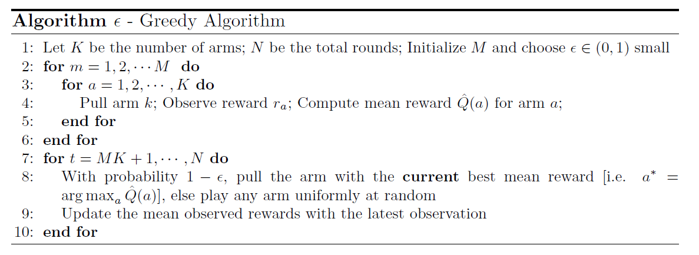
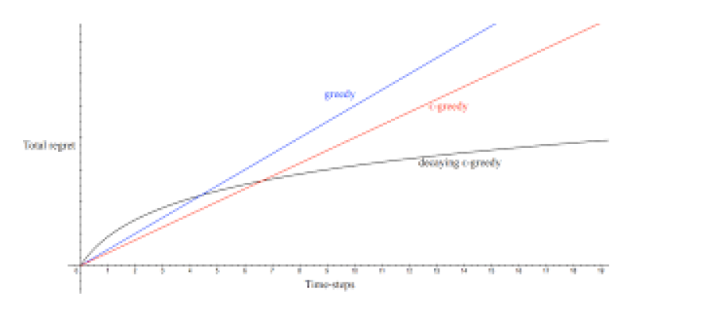
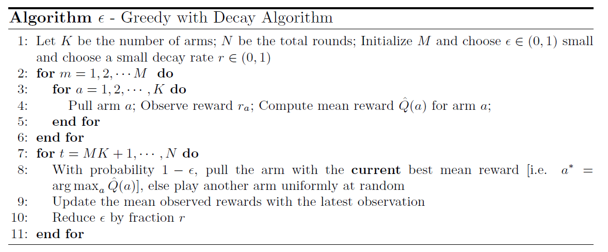

# Multi-Arm Bandits Naive Approaches

#### Table of Contents

- [Explore Then Commit](#explore-then-commit)
- [Epsilon Greedy with Epsilon Decay](#epsilon-greedy-with-epsilon-decay)
- [Optimistic Initialization](#optimistic-initialization)

## Explore Then Commit
Suppose our budget is 100 trials. The objective is to maximize the total rewards $\sum_t^{100} r_t$. Our focus is not to find the best arm. In the process if we find it, then we can exploit it. But that is not our goal. The simplest naive algorithm for rewards maximization is:

We split the $N$ trials for exploration and exploitation. $M * K$ is the budget for exploration. Each arm is pulled $M$ times. Then, we will exploit for the remaining trials. This algorithm works by the principle of law of large numbers.

Suppose $X_1, X_2, \dots$ are independent samples of a random variable $X$ having mean $\mu$. Then, the empirical mean of $M$ samples is defined as:

$$
\hat{\mu}_M = \frac{1}{M} \sum_{i=1}^M X_i
$$

* Weak law of large numbers states that $\hat{\mu}_M \to \mu$ in probability as $M \to \infty$.
* Strong law of large numbers states that $\hat{\mu}_M \to \mu$ almost surely as $M \to \infty$.

The convergence guarantee is there in the asymptotic sense, that is, as $M \to \infty$. But in practice, we don't have infinite budget. A limited budget of $M$ for each arm $a$ may not be sufficient to determine the true mean reward $Q(a)$. After $M$ rounds, we have the empirical mean reward for pulling arm $a$:

$$
\hat{Q}(a) = \frac{1}{M} \sum_{t=1}^M r_t
$$

This $\hat{Q}(a) \to Q(a)$ only as $M \to \infty$.

**Problem 1:** The Explore then commit (ETC) is a purely greedy algorithm. After the exploration phase, for any time $t = M*K, \dots, N$, we select the action with the highest $\hat{Q}_{\tau}(a)$ where $\tau = M*K$

$$
a_t = \arg \max_{a \in \mathcal{A}} \hat{Q}_{\tau}(a)
$$

As $M*K$ trials may not be sufficient to determine the best $\hat{Q}$ (the best arm), this algorithm can lock into a sub-optimal arm early on. Since it never explores other options, it continues to pick the non-optimal arm, incurring a fixed amount of regret at every subsequent time step. Over $N$ steps, this constant per-step regret adds up to a linear total regret. So, the above greedy algorithm will have a linear total regret.

**Problem 2:** ETC does not use the experience generated after the exploration phase. We are being fully greedy here; we don't take any learnings from trials $t = MK + 1, \dots, N$.

Problem 1 can be solved by extending the exploration in the exploitation phase as well. Instead of being full greedy, we can be $\epsilon$-greedy. That is, we pull the best arm with probability $1-\epsilon$ and any arm (including the optimal one) randomly with probability $\epsilon$. Problem 2 can be addressed by updating the mean observed rewards $Q(a)$ with the latest observation in the exploitation phase. Then our algorithm will be:

In step 9, we update the action value by incremental Monte-Carlo evaluation. Let $a$ be the arm pulled at round $t$. Then,

$$
\hat{Q}_t(a) = \hat{Q}_{t-1}(a) + \frac{1}{N_t(a)} \left(r_t - \hat{Q}_{t-1}(a) \right)
$$

where $r_t$ is the reward obtained at round $t$.

The $\epsilon$- greedy algorithm explores forever, so it will also have a linear total regret. Here $\epsilon$ is a constant, it doesn't decay. Suppose

* Arm $a_1$ is the optimal arm with mean reward $Q(a_1)$
* Arm $a_i$ be a suboptimal arm with mean reward $Q(a_i)$
* Gap $\Delta_{a_i} = Q(a_1) - Q(a_i) > 0$

At each time step $t$,
* With probability $(1- \epsilon)$, the algorithm chooses the empirical best arm.
* With probability $(\epsilon)$, the algorithm explores.

The expected regret per time step is:

$$
l_t = (1- \epsilon) \cdot \mathbb{E}[\text{regret from exploitation}] + \epsilon \cdot \mathbb{E}[\text{regret from exploration}]
$$

Under fixed $\epsilon$ greedy, even though the algorithm keeps exploring, it learns the true best arm with probability 1 as the trials goes to infinity. Once this happens, the exploitation steps almost surely pick the actual best arm. Thus, $\mathbb{E}[\text{regret from exploration}] \to 0$ after the initial learning phase. So the exploitation part contributes only a finite, O(1), amount to total regret. When computing regret per time step asymptotically, the contribution of the exploitation term goes to:

$$
\frac{O(1)}{N} \to 0
$$

Exploration regret stays strictly positive at every time step. The algorithm pulls a suboptimal arm with probability roughly $\frac{K-1}{K}$.

$$
\begin{align*}
\epsilon \cdot \mathbb{E}[\text{regret from exploration}] & = \epsilon * \frac{1}{K} * (Q(a_1) - Q(a_1)) + \epsilon * \frac{1}{K} * (Q(a_1) - Q(a_2)) + \dots + \epsilon * \frac{1}{K} * (Q(a_1) - Q(a_K)) \\
& = \epsilon \sum_{a_i \ne a_1} \frac{1}{K} \Delta_{a_i} = c_{\epsilon}
\end{align*}
$$

This is a strictly positive constant and doesn't vanish as $N \to \infty$. The cumulative reward over $N$ time steps is then

$$
L_N = \sum_{t=1}^N c_{\epsilon} = N \cdot c_{\epsilon}
$$

This increases as $N$ increases. Therefore, this $\epsilon$-greedy algorithm has linear total regret.

* Algorithms that explore forever have total linear regret
* Algorithms that never explore have total linear regret

Therefore, both the greedy and the $\epsilon$ greedy algorithms are not good candidates. Is it possible for develop algorithms have sub-linear regret?

## Epsilon Greedy with Epsilon Decay
For certain choices of decay schedule, $\epsilon$ greedy with $\epsilon$ decay can achieve sub-linear regret (logarithmic total regret). Sublinear regret means the algorithm's performance gap shrinks over time as it learns which arm is best, eventually converging to a near-optimal policy where future regret accumulation becomes negligible.

Here $M$ can be much lower than in the previous algorithms. That is, the budget for the strict exploration phase can be much smaller.

## Optimistic Initialization

Optimistic Initialization is another exploration technique. The idea is to initialize $Q(a)$ for all actions to a high value to encourages exploration early on.

* In Q-learning, we initialize $Q(s,a)=0$ for all state-action pair. Assume the true Q values are positive for all $(s,a)$. Being in a state, initially, we pick an action randomly. Then, we update that particular $Q(s,a)$. Since we have initialized 0 for all $Q(s,a)$, the subsequent updates will increase it (to tend towards the true Q value). The $Q(s,a)$ will remain 0 for all other non-updated pairs. In subsequent visits to state $s$, we choose an action that has the maximum Q value. So, the updated action is always chosen as it has a high $Q$ value. This kills exploration.

* Instead, if we initialize them to some high value, it will encourage systematic exploration early on. Being in a state, initially, we pick an action randomly. Then, we update that particular $Q(s,a)$. Since we have initialized a very high value for all $Q(s,a)$, the subsequent updates will decrease it. The $Q(s,a)$ will remain high for all other non-updated pairs. This encourages those unexplored actions to be chosen in the subsequent visits to state $s$ because now they have high Q value than the explored (and updated) one.

The similar reasoning can be extended to multi-arm bandit Naive algorithms as well. We can use: $\epsilon$ greedy with $\epsilon$ decay + Optimistic Initialization.

