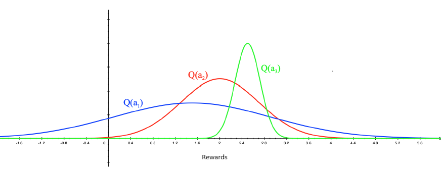
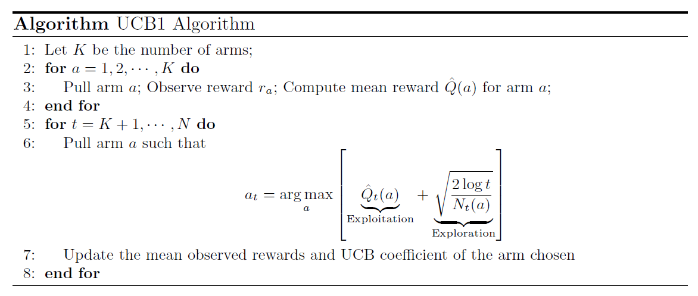

# Multi-Arm Bandits Algorithms

#### Table of Contents

- [Optimism in the Face of Uncertainty](#optimism-in-the-face-of-uncertainty)
- [Upper Confidence Bound](#upper-confidence-bound)
- [Hoeffding's Inequality](#hoeffdings-inequality)
- [UCB1 Algorithm](#ucb1-algorithm)

## Optimism in the Face of Uncertainty
Suppose we have three arms $a_1, a_2, a_3$. We pull these arms for some number of times, say $M$ times. Then, we plot the distribution of rewards from each arm:

Which arm (among the three) should we choose at next round? Among the three arms, we are uncertain about the first arm because it's empirical reward distribution has high variance. In the $M$ trials, we might have pulled $a_3$ far more number of times than the other two. So, we are more uncertain about the estimate of $a_1$ reward distribution and its mean $Q(a_1)$ as $a_1$ has been explored enough.

Optimism in the Face of Uncertainty principle says we should pick the arm we are most uncertain about. And we can be optimistic about the arm we are uncertain about. The more uncertain we are about the action-value (mean reward) of an arm, the more we should explore that action; as it could turn out to be the best action.

## Upper Confidence Bound
Let's estimate an upper confidence bound $\text{UCB}_t(a)$ for action $a$ at time $t$

$$
Q(a) \leq \hat{Q}_t(a) + \hat{U}_t(a)
$$

This is the highest value that the true mean could plausibly be given the data observed up to time $t$.

* $Q(a)$ is the true expected reward of arm $a$. This is unknown to us.
* $\hat{Q}_t(a)$ is the sample mean reward of arm $a$ up to time $t$. This is just the sample average based on observed pulls.
* $\hat{U}_t(a)$ is the confidence width (or) uncertainty term. It is a single scalar that quantifies how uncertain you are about the empirical mean $\hat{Q}_t(a)$. Mathematically, it plays the role of a width of a confidence interval:

    $$
    [\hat{Q}_t(a) - \hat{U}_t(a) , \hat{Q}_t(a) + \hat{U}_t(a)]
    $$

The goal in UCB is to guarantee, with high probability, that: 

$$
\text{True expectation} \leq \text{sample mean} + \text{Uncertainty width}
$$

More precisely,

$$
\mathbb{P}\left(Q(a) \leq \hat{Q}_t(a) + \hat{U}_t(a) \text{ for all arms and all times} \right) \geq 1 - \delta
$$

This is a statistical concentration guarantee. It expresses that all empirical means are within a certain distance of their true means, with high probability, according to inequalities like Hoeffding’s. Our goal is to constructs $\hat{U}_t(a)$ so that this inequality is true uniformly across arms and time steps. The uncertainty term depends on the number of times an arm $a$ has been pulled so far:

* Small $N_t(a) \implies $ large  $\hat{U}_t(a)$
* Large $N_t(a) \implies $ small  $\hat{U}_t(a)$

If we are able to construct such an uncertainty term, then we can make the algorithm to select action $a$ at time $t$ such that the summation of its empirical mean reward and uncertainty up to time $t-1$ is maximum.

$$
a_t = \arg \max_{a \in \mathcal{A}} [\hat{Q}_{t-1}(a) + \hat{U}_{t-1}(a)]
$$

In the beginning of the trials, the second term dominates more - allowing us to explore the arm that we have pulled less number of times. As the number of trials increases, the first term dominates and the second term will become negligible. Over time steps, we will eventually be greedy. Note: A purely greedy algorithm we looked at earlier doesn't consider the uncertainty term. It has only the first term.

Hoeffding's inequality provides a way to arrive at the formulation for $\hat{U}_t(a)$.

## Hoeffding's Inequality

Hoeffding's inequality theorem states:

Let $X_1, \dots, X_t$ be i.i.d random variables, and they are all bounded by any interval, for simplicity assume $[0,1]$. The sample mean of $t$ samples is $\bar{X}_t = \frac{1}{t} \sum_{\tau=1}^t X_{\tau}$. Then for any $u>0$, we have

$$
\mathbb{P}\left(\mathbb{E}[X] > \bar{X}_t + u \right) \leq e^{-2tu^2}
$$

This inequality holds for any $u >0$ of our choice. Such inequalities are known as concentration bounds. This gives a probabilistic way for saying how close the estimated mean is to the true mean. On applying Hoeffding's inequality to the rewards of the bandit:

$$
\mathbb{P}\left(Q(a) > \hat{Q}_t(a) + \hat{U}_t(a) \right) \leq e^{-2 N_t(a) * \hat{U}_t(a)^2}
$$

Pick a probability $p$ that true value exceeds UCB, that is, pick a value for RHS:

$$
p = e^{-2 N_t(a) * \hat{U}_t(a)^2}
$$

Now solve for $\hat{U}_t(a)$. Then,

$$
\hat{U}_t(a) = \sqrt{\frac{- \log p}{2 N_t(a)}}
$$

It is reasonable to assume $p$ as a function of $t$. As $t$ increases, we want to reduce $p$ because we want to reduce the chance of UCB being less than the true expected reward. In other words, we want to increase the probability of the event $Q(a) \leq \hat{Q}_t(a) + \hat{U}_t(a)$. A better choice is to have $p = t^{-4}$. On substituting this, we get

$$
\hat{U}_t(a) = \sqrt{\frac{2 \log t}{N_t(a)}}
$$

### UCB1 Algorithm

* In step 2, we pull every arm once. This is necessary to avoid having 0 for $N_t(a)$ in the denominator of the uncertainty term.

* In step 6, we choose that arm for which the UCB is the maximum. As we keep choosing such arms, their UCB will reduce down because of the reduction in the uncertainty (the exploration term). The second term has $N_t(a)$ in the denominator, so it will be reduced for arm $a$ as we pull it more number of times. Then eventually, the arm with the highest empirical mean will be chosen. This objective balances the exploration-exploitation trade-off.

The UCB1 algorithm is also an exploration technique that can be plugged in RL algorithms in place of $\epsilon$-greedy with $\epsilon$-decay exploration schedule. This algorithm ensures optimal action selection asymptotically (as $t\to \infty$). It doesn't explore forever. And it has sublinear regret.

**Assumptions Matter**

The Hoeffding's inequality assumed that the random variables are i.i.d, and they are bounded. We have made no assumptions about the reward distribution of each arm. If we also assume the form of the reward distribution (parameters of the distribution remain unknown) such as Bernoulli, Gaussian with unknown mean unit variance, etc., then we can get tighter concentration bounds by specializing the Hoeffding's inequality equation for that particular distribution. When the concentration bounds are tighter, we get a better estimate of uncertainty. This leads to a better way of doing exploration-exploitation trade-off.