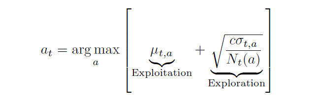

# Bayesian Bandit Algorithms

#### Table of Contents

- [Bayesian Bandits](#bayesian-bandits)
- [Bayesian UCB](#bayesian-ucb)
- [Thompson Sampling](#thompson-sampling)

## Bayesian Bandits
So far we have made no assumptions about the reward distribution $\mathcal{R}$ (except bound on rewards).

A Bayesian bandit algorithm maintains a probability distribution over the unknown reward parameter of each arm. This distribution represents the algorithm's belief about how good each arm is, given all past observations. Formally, for arm $a$

$$
R_t(a) \sim p(r \, | \, \theta_a)
$$

We assume that the rewards are sampled from the distribution $p(r \, | \, \theta_a)$ parameterized by $\theta_a$. We assume a prior over $\theta_a$.

* If the rewards are Gaussian: Suppose the reward from arm 
$a$ is modeled as:

    $$
    R_t(a) \sim \mathcal{N}(\mu_a, \sigma_a^2)
    $$

    with known noise variance $\sigma_a^2$. Then the unknown parameter is $\theta_a = \mu_a$. The conjugate prior is Gaussian. So, we assume $\theta_a \sim \mathcal{N}(\mu_0,\sigma_0^2)$.

* If the rewards are Bernoulli: Suppose the reward from arm $a$ is modeled as:

    $$
    R_t(a) \sim \text{Ber}(p_a)
    $$

    Then $\theta_a = p_a$. The conjugate prior is a Beta distribution. So, we assume $\theta_a \sim \text{Beta}(\alpha_0, \beta_0)$.

Upon pulling arm $a$, observe reward $r_a$. The belief is updated using the Bayes' rule.

$$
p(\theta_a \, | \, \text{data}) \propto p(\text{data} \, | \, \theta_a) \, p(\theta_a)
$$

This produces a posterior distribution capturing what is now believed about the arm. This step makes Bayesian bandits naturally balance exploration and exploitation, because uncertainty is represented directly in the posterior. We then use posterior to guide exploration. Two major Bayesian bandit algorithms implement different ways of using the posterior to choose the next arm.

## Bayesian UCB
For each arm $a$, we compute a Bayesian credible upper bound:

$$
\text{BUCB}_t(a) = \text{posterior mean} + \text{constant} * \text{posterior standard deviation} 
$$

At time step $t$, we choose the arm with the largest BUCB. This is the Bayesian analog of classical UCB.

Once the arm is chosen and reward is received, its posterior is updated.

Bayesian Bandit algorithms work well when priors model the reward distribution effectively.

## Thompson Sampling
Let's consider a Bernoulli Bandit. The bandit gives a reward of either 0 or 1. Each one of the $K$ machines has a probability of $\theta_k$ of providing a reward to the player.

From 33:00 pending
