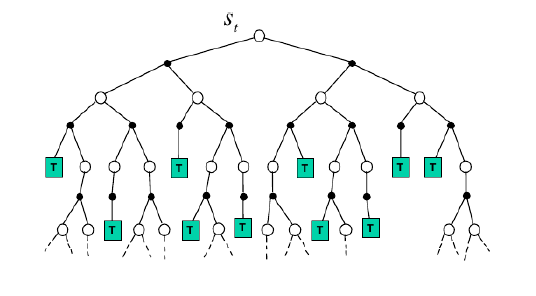
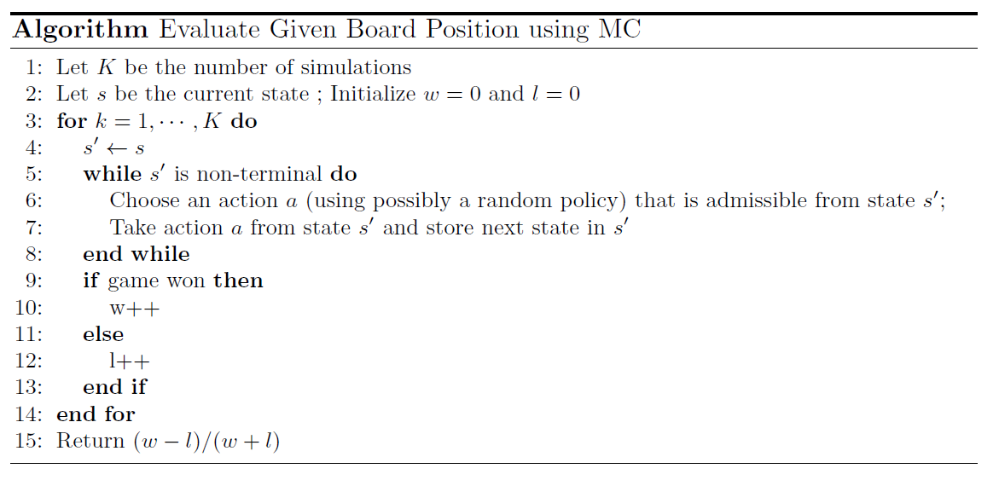
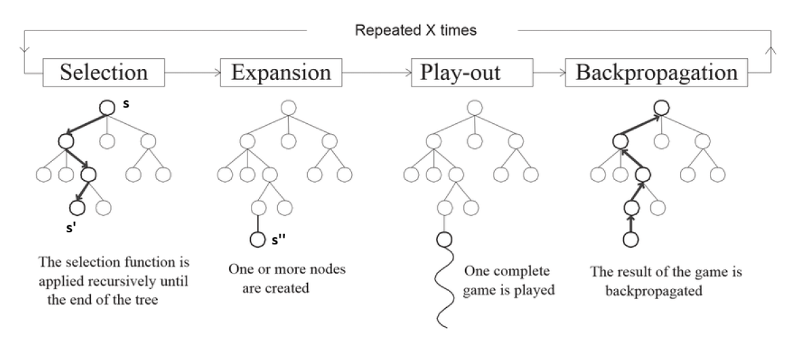
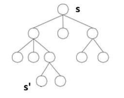
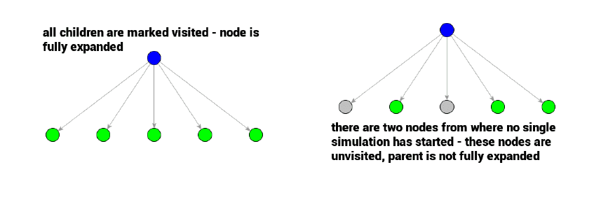
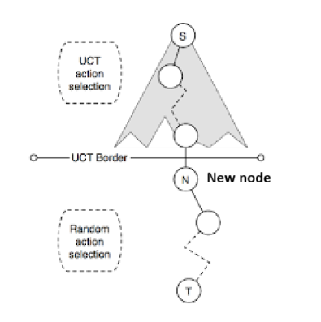

# Tree Search Algorithms

#### Table of Contents

- [Introduction](#introduction)
- [Tree Search Methods - Framework](#tree-search-methods---framework)
- [Training an RL agent](#training-an-rl-agent)
- [Position Evaluation Using Monte Carlo](#position-evaluation-using-monte-carlo)
- [Monte Carlo Tree Search](#monte-carlo-tree-search)
- [Closing Remarks](#closing-remarks)

## Introduction
Monte Carlo Tree Search (MCTS) is a heuristic search algorithm that uses the concept of bandit algorithms in order to explore game tree. It combines the principles of tree search with random sampling to make optimal decisions in complex environments.

We consider board games; specifically, two player zero-sum perfect information board games.

* Zero-sum refers to the fact that one player's gain is another player's loss. If we add the rewards of both the players, we will get 0.
* Perfect information means that both players have access to all information about the game state at all times (e.g., tic-tac-toe, chess, Go). Card games like poker are not perfect information games because players do not have access to each other's cards.

The goal is to select the best possible move from a given game state (board position). We can construct a game tree starting from the initial state, and make each possible move as a branch. All branches of the tree terminates at some state, giving us the result of win or loss.

## Tree Search Methods - Framework
Figuring out the next best move is equivalent to figuring out the next best child node to traverse from the current node.

$S_t$ is current game position. This is considered as the root. Branches are actions. Black dots are opponent's actions and white dots are our actions.

There are many tree search methods. Forward tree search methods are popular to arrive at optimal moves in such board games. These algorithms select the best action by lookahead. To do this, we model the game as an MDP. The states of the MDP are the board positions. The actions are the possible moves from each board position. The transition dynamics are deterministic, as each action leads to a specific next state. There is no randomness in the environment.

* Build a search tree with the current game position as the root
* Compute value function of the next states by simulating several trajectories.
* Select the next best move.

Modelling the game as an MDP is a naive approach. It is hard to compute a good value function for each state of the game because board games typically have many states (Go: $10^{170}$, chess: $10^{48}$). The breadth (possible actions in each state) and the depth of the game tree (number of steps to complete the game) are high. So, the value functions can't be learnt offline. Therefore, we

* Build a search tree with the **current game position** as the root.
* Solve the sub MDP starting from the current game position. That is, simulate episodes from current game position and apply model-free RL techniques to compute the value of the states.

This enables us to online planning. Online planning refers to the process of making decisions in real-time, based on the current state of the environment, rather than pre-computing a complete plan in advance. For example, in chess, we have to make decisions based on the current new board state after every turn because pre-computing all possible moves and outcomes is infeasible due to the vast number of possibilities. In games like tic-tac-toe, we can pre-compute the entire game tree (offline planning) because the number of possible board states is limited.

## Truncated Tree Search
In complicated games, the sub-MDP rooted at the current game position may still be very large because:

* Many possible actions from any given node - Large branching factor (large breadth)

    We can't actually do an exhaustive search of the game tree. That is, we can't explore all possible moves and outcomes to find the best possible move. So we have to limit our search intelligently to specific branches of the game tree. We can reduce the breadth of the search by sampling actions from a policy $\pi(a \, | \, s)$ instead of trying every action.

* More steps to go - Large tree depth

    Typically, we can't do the game tree search till the end of the game. We can reduce the depth of the search tree by position evaluation. Truncate the search tree at state $s$ and replace the subtree below $s$ by an approximate state value $V(s)$. The value of the states are typically learned from self play (or) engineered using human experts (asking them the value of the current board position).

This way we can achieve intelligent search instead of an exhaustive search.

## Training an RL agent
When we train our RL agent against any sophisticated player as the opponent, the opponent will take us only through specific branches of the game tree. This is because the opponent is aware of the best moves given a state, and it will always choose that particular branch. Therefore, the opponent doesn't let us explore certain state-action pairs at all during training. The trained RL agent doesn't know what to do if it gets to those unexplored states during inference.

In contrast, a random opponent player will let us explore all branches of the tree (all state-action pairs) during training.

* An agent trained against a safe opponent may play well with a safe player, but it will probably lose when played with a random player.

* An agent trained against a random opponent and if the training is sufficient, then the trained agent will outperform when played with **any** opponent. So, training our RL agent against a random opponent is always better.

NOTE: Self-play is a way of training in which we don't have any opponent. We initialize two Q tables (one for us and the other for the opponent). Fix the opponent's Q table, play the game and improve our agent's Q table. After some iterations, fix our Q table. Play the game and improve the opponent's Q table. Continue this process.

Let's look at some naive approaches for position evaluation using Monte Carlo.

## Position Evaluation Using Monte Carlo

**State Value Function Evaluation:**

Assume we are at a state $s$ (can be any intermediary game position). Roll out $K$ trajectories from $s$ till the terminal state using a simulation (random) policy. Each simulation will take us through a different branch of the game tree.

This algorithm evaluates the value $V$ of a given state using Monte Carlo.  Step 15 is one of the metrics that gives us the value of the state $s$. We can also use any other metric based on number of wins, losses, and draws.

**Action Value Function Evaluation:**

For each action $a \in \mathcal{A}$, roll out $K$ trajectories from the current board $s$ till the terminal state using a simulation (random) policy. Calculate the total reward and use it to compute action value estimate:

$$
Q(s, a) = \frac{1}{K} \sum_{k=1}^K G_t
$$

## Monte Carlo Tree Search

The MCTS algorithm is an elegant, sophisticated, intelligent tree search method that builds a search tree incrementally, using random simulations to evaluate the potential outcomes of different moves. Apart from two player perfect games, the MCTS method can also be used in situations where online planning is necessary. The MCTS method can be applied for general-sum (in addition to zero-sum) and more than 2 players games as well.

There are four phases in the MCTS method: Selection, Expansion, Play-out, and Backpropagation. These four phases are repeated many times.

**Selection:**

Assume $s$ is our current board position. Say there are three actions possible in this state, and we have explored each one of them at least once. Grey nodes are explored at least once. This is our current explored game tree.

Now, when we are at $s$ again, among the three actions possible, we choose an arm that maximizes

$$
a_t = \arg \max_a \left[ Q(s,a) + c \cdot \sqrt{\frac{\log N}{n_a}} \right]
$$

This is a variant of the UCB1 formula where there are three actions $a$ possible, $N$ is the number of times the parent node is visited (that is, the number of times we pulled the arms) and $n_a$ is the number of times action $a$ has been picked. We can use this UCB formula to choose an action until we reach a node that is not explored. This helps us balance exploration and exploitation.

Now, say we come to a state $s'$ from which we have not explored yet. Such a node is known as a frontier. That is, the node is either not fully-expanded or not expanded at all. Say five actions are possible from this node. When we have tried only two actions at least once, then we say the node is not fully expanded. When we haven't tried any action, then we say the node is not expanded. The node $s'$ is called as frontier.

In the initial iterations, the node $s$ is itself a frontier. So, selection phase is skipped, we directly go to the expansion phase. The node $s$ will remain as a frontier until all possible actions from $s$ are explored **at least once**. When $s$ becomes a non-frontier, UCB is applied at $s$ to choose the best action.

Here in the left graph parent node, selection phase (UCB selection) is applied whereas in the right graph parent node, expansion phase is applied. The UCB way of picking the action ensures that we evaluate the moves intelligently rather than evaluating all possible moves to choose the best move.

**Expansion:**

Once we reach a frontier, take an action randomly that is not explored before. This will add one new node $s''$ to the tree. We are building the game tree in this phase. This is the only phase where new nodes are added to the tree.

**Play-out:**

From $s''$, play a complete game using a random policy for both **the agent and the opponent**. This will terminate eventually in some leaf node, and we either win, loss, or tie the game.

UCT refers to upper confidence bound for trees. Until the frontier (UCT Border), UCB algorithm is used. After that, we add a new node, and then we do play-out.

**Backpropagation:**

After reaching a terminal node, the result of the game (either win, loss, or draw) is backpropagated to all the nodes in the traversed path from $s''$ to $s$. That is, for each node, the action-value $Q(s,a)$, number of visits to the node, and the number of times an action is pulled are updated.

## Closing Remarks
MCTS is an any-time algorithm; we can stop the training at any time. But the performance will be better if we train it for a more number of iterations. Once the training is done, we can decide the best action (child node) at a node based on the:

* Highest mean reward (highest probability to win) - based on only the first term in the UCB.
* Highest UCB
* Most simulated move

MCTS can be applied to a variety of games, as it is domain independent.

**Pending:**
DFO (Derivative free optimization) / evolutionary methods (1:24:00). The objective of these methods is to determine the optimal policy (same objective as policy gradient). These methods can be used for benchmarking any new RL algorithm. That is, the performance of our new RL algorithm can be benchmarked against the performance of the DFO methods. Our RL algorithms should do much better than DFO.
