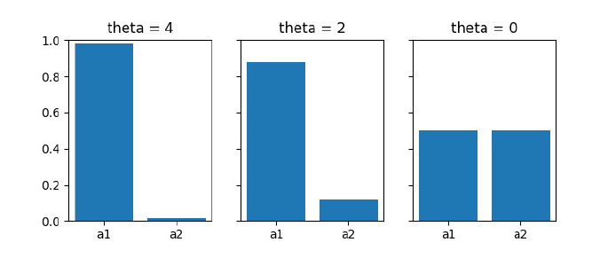
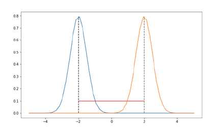
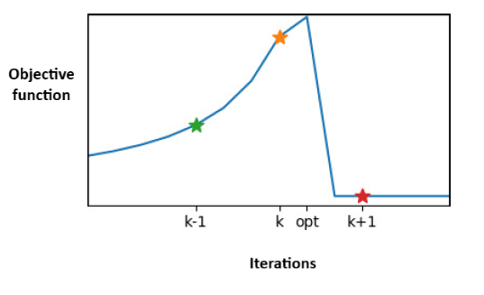
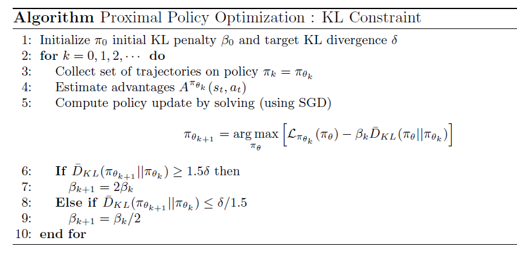
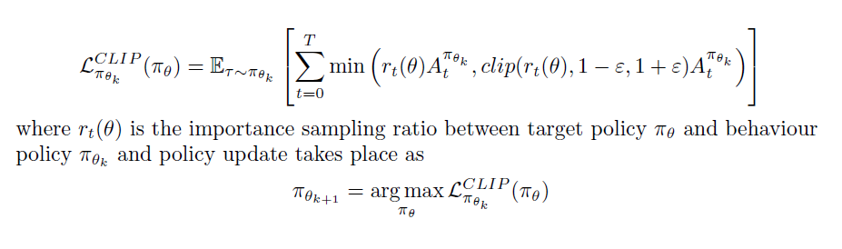
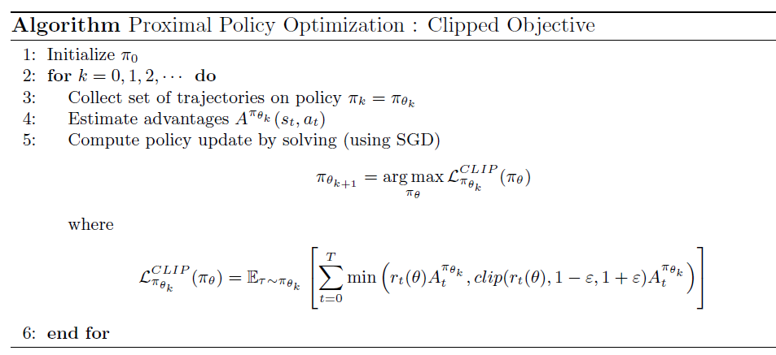

# Advanced Policy Gradients

#### Table of Contents

- [Introduction](#introduction)
- [Limitation of Policy Gradient Methods](#limitation-of-policy-gradient-methods)
- [KL Divergence between Policies](#kl-divergence-between-policies)
- [Proximal Policy Optimization](#proximal-policy-optimization)
    - [Adaptive KL Penalty](#adaptive-kl-penalty)
    - [Clipped Objective](#clipped-objective)

## Introduction
Policy gradient algorithms try to solve the optimization problem with the objective function (start value objective function) as:

$$
J(\theta) = \mathbb{E}_{\tau \sim \pi_{\theta}} \left[\sum_{t=0}^\infty \gamma^t r_{t+1} \, | \, S_0 = s_0 \right]
$$

We want to find $\theta$ that maximizes this objective function. So, we took stochastic gradient ascent on the policy parameters $\theta$

$$
\nabla_{\theta} J(\theta) = \mathbb{E}_{\tau \sim \pi_{\theta}} \left[ \sum_{t=0}^\infty \nabla_{\theta} \log \pi_{\theta}(a_t \, | \, s_t) \cdot  \Psi_t \right] 
$$

Here the $\Psi(t)$ could take any of the following forms:

1. $\Psi_t = Q^{\pi_{\theta}}(s_t, a_t)$: State action value function.
2. $\Psi_t = A^{\pi_{\theta}}(s_t, a_t) = Q^{\pi_{\theta}}(s_t, a_t) - V^{\pi_{\theta}}(s_t)$: Advantage function.
3. $\Psi_t = r_{t+1} +  \gamma V^{\pi_{\theta}}(s_{t+1})  - V^{\pi_{\theta}}(s_t)$: One-step TD Residual.

## Limitation of Policy Gradient Methods

**Limitation 1: Sample inefficiency**

Any version of the policy gradient algorithm we have seen so far are on-policy algorithms. That is, they require samples generated from the current policy $\pi_{\theta}$ to compute $\nabla_{\theta} J(\theta)$ and update $\theta$. In order to improve $\theta$, we are using the samples generated using the same $\theta$. This limits the sample efficiency of these algorithms since we cannot reuse the data collected from previous policies. Generating new samples from the updated policy (updated $\theta$) after every policy update is computationally expensive and time-consuming, and sometimes infeasible in real-world applications.

If we want to use samples from other policies, then the above gradient term needs correction using importance sampling weights. Suppose we use samples from $\tau \sim \pi_{\eta}$ instead of generating trajectories from $\tau \sim \pi_{\theta}$. We can rewrite the gradient estimate as

$$
\nabla_{\theta} J(\theta) = \mathbb{E}_{\tau \sim \pi_{\eta}} \left[ \frac{P(\tau \, | \, \pi_{\theta})}{P(\tau \, | \, \pi_{\eta})} \sum_{t=0}^\infty \nabla_{\theta} \log \pi_{\theta}(a_t \, | \, s_t) \cdot  \Psi_t \right] 
$$

where

$$\frac{P(\tau \, | \, \pi_{\theta})}{P(\tau \, | \, \pi_{\eta})} = \frac{\mu(s_0) \prod_{t=0}^\infty \pi_{\theta}(a_t \, | \, s_t) \, P( s_{t+1} \, | \, s_t, a_t)}{\mu(s_0) \prod_{t=0}^\infty \pi_{\eta}(a_t \, | \, s_t) \, P( s_{t+1} \, | \, s_t, a_t)} = \prod_{t=0}^\infty \frac{\pi_{\theta}(a_t \, | \, s_t)}{\pi_{\eta}(a_t \, | \, s_t)}
$$

The IS weight is computed from the probability ratios by multiplying them from $t=0$ to $\infty$. So, even for policies which differ slightly from each other, many small differences multiply to become a big difference and IS weights can explode or vanish. This is a likely event to happen. So, we cannot plug this IS weight in the computation of $\nabla_{\theta} J(\theta)$.

How can we efficiently use samples from old policies while avoiding the challenges posed by importance sampling?

**Limitation 2: Updates in Parameter Space**

Policy gradient takes step in the parameter space.

$$
\theta_{n+1} = \theta_n + \alpha \nabla_{\theta_n} J(\theta_n)
$$

But we actually wanted to take steps in the policy space which is a disribution space. As the policies are parameterized by $\theta$, we are taking steps in the parameter space. Example of a policy space: for finite state and action case, the policy space can be given by:

$$
\Pi = \left\{\pi: \pi \in \mathbb{R}^{|\mathcal{S}| \times |\mathcal{A}|}, \sum_a \pi_{sa}=1, 0 \leq \pi_{sa} \leq 1  \right\}
$$

where $\Pi$ is a set of matrices of size $|\mathcal{S}| \times |\mathcal{A}|$ where each row sums up to 1 and all the elements lie between 0 and 1. Each element of this set is a probability transition matrix.

When we take a step in the parameter space, we are moving from an old $\theta_1$ to a new $\theta_2$. This will in turn make us move from one transition matrix $\pi_1$ to another transition matrix $\pi_2$. But we are not doing it explicitly. When we take a step in the parameter space, we are not concerned about what is happening in the policy space.

Distance in parameter space is not equal to the distance in the policy space. So, we have to be cautious of what is happening in the policy space when we take a step in the parameter space.

**Difference in Policy Space:**

Consider a single state MDP with two possible actions $\mathcal{A} = \{a_1,a_2\}$. Consider a set of policies that arise from the following parameterization:

$$
\pi_{\theta}(a) = \begin{cases}
\sigma(\theta), & \text{if } a = a_1 \\
1 - \sigma(\theta), & \text{if } a = a_2 \\
\end{cases}
$$

The policy is parameterized by $\theta$. For different values of $\theta$, the policy will be:

Each one is a stochastic policy. We can observe here how small changes in the policy parameter $\theta$ can unexpectedly lead to big changes in the policy. When we move from $\theta=2$ to $\theta=0$, we end up in a totally different distribution. These two distributions (b) and (c) will be far apart in the policy space compared to distributions (a) and (b).

This effect can be observed when the action space is continuous as well. Suppose the policy is Gaussian distributed over the action space. The policy is parameterized by $\mu$ and a fixed variance. When we move from $\mu=-2$ to $\mu=2$, the distribution shift is:

These two distributions hardly share any support. These two distributions will be far apart in the policy space.

**The Step Size Issue:**

Limitation 2 makes us difficult to choose the right step size $\alpha$ in the gradient update equation. The problem in limitation 2 exists in supervised ML algorithms as well where we use the gradient descent to update the parameters of a function. Here in policy gradient RL setting, we are updating the parameters of a distribution. In both these settings

* When the step size is too large, the performance of the algorithm collapses.

* When the step size is too low, we get slow progress.

Each iteration is carried out with the updated parameters. Depending upon the step size in the parameter update, we may fail to each the optimal parameter.

Consequence of this problem in RL setting is more severe than for supervised learning because in RL we need to generate the data ourselves. In the policy gradient RL setting, say we land up in such a policy corresponding to the parameters in iteration $k+1$. Then, the samples generated from this policy will be poor, and improving the policy from here will be a lot difficult.

NOTE: In the PG algorithm, we typically throw away the samples generated from the old policy, and generate a new set of samples after every udpate.

Therefore, we should be very cautious of the step size in the PG algorithm. In the ML setting, this issue of overshooting is mitigated by using decaying step size. This technique can't be extended to the RL setting as we don't know what is happening in the policy space for our moves in the parameter space.

**Desiderata:**

We need to have an algorithm that kind of overcomes both the limiations of the PG algorithm.

* How to make use of data from old policy while avoiding challenges that arise from importance sampling?

    Have an algorithm that at least uses roll-outs from most recent policy as effectively as possible.

* How to design an update rule that doesn't change the policy more than we intend to?

    Take steps that respect notion of distance in policy space rather than in parameter space. We will still be taking steps in the parameter space, but we should be cognizant of the resulting changes in the policy space.

## KL Divergence between Policies

There are various ways to define distance in a distribution space, i.e., distance between two distributions. KL divergence is one of them.

For any two probability distributions $P$ and $Q$ over the random variable $X$, the KL divergence from $P$ to $Q$, $D_{KL}(P || Q)$, is defined as

$$
D_{KL}(P || Q) = \sum_x P(x) \log \frac{P(x)}{Q(x)}
$$

KL divergence has the following properties:

* $D_{KL}(P || Q) \geq 0$
* $D_{KL}(P || P) = 0$
* $D_{KL}(P || Q) \ne D_{KL}(Q || P)$ - It is not a metric; symmetricity doesn't hold.

KL divergence between policies $\pi'$ and $\pi_0$ for a given state $s$ is

$$
D_{KL}(\pi' || \pi_0)[s] = \sum_{a \in \mathcal{A}} \pi'(a \, | \, s) \log \frac{\pi'(a \, | \, s)}{\pi_0(a \, | \, s)} \tag{1}
$$

## Proximal Policy Optimization

Proximal Policy Optimization (PPO) is a family of methods that come under the class of natural policy gradient algorithms. PPO algorithm is used to fine tune the LLMs.

### Adaptive KL Penalty

This version of PPO algorithm enforces a KL divergence constraint between the new and old policies while performing policy updates. The idea is to ensure that the updated policy does not deviate too much from the previous policy.

And a new objective function $\mathcal{L}_{\pi_{\theta_k}}(\pi_{\theta})$, called the surrogate loss function, is used. Therefore, inplace of the start state objective $J(\theta)$, our new objective has two terms. And our goal is to:

$$
\pi_{\theta_{k+1}} = \arg \max_{\pi_{\theta}} \left[
    \mathcal{L}_{\pi_{\theta_k}}(\pi_{\theta}) -
    \beta \bar{D}_{KL}(\pi_{\theta} || \pi_{\theta_k})
\right]
$$

The second term penalizes the loss function. We still use gradient ascent and move in the parameter space. The result is the next $\pi_{\theta_{k+1}}$ (not the optimal $\theta^*$). In every step of the gradient ascent, if the chosen $\theta$ results in a policy $\pi_{\theta}$ that is very far from the current policy $\pi_{\theta_k}$, then a high penalty is applied. This constraint keeps the updates to $\theta$ (the step size $\alpha$) in such a way that the resulting policy $\pi_{\theta_{k+1}}$ is close to $\pi_{\theta_k}$. That is, it ensures that the two successive policies in our iterations are not far away from each other. Penalty co-efficient $\beta$ is changed between iterations to approximately enforce KL constraint.

Note: Equation <a href="#eq:eq1">(1)</a> represents the KL divergence for a particular state $s$. But here we a bar in the KL divergence term $\bar{D}_{KL}(\pi_{\theta} || \pi_{\theta_k})$ because it represents the average of the distances over all possible states of the MDP, $ \frac{1}{|\mathcal{S}|}\sum_{s \in \mathcal{S}}D_{KL}(s)$.

Initial KL penalty not that important; it adapts quickly. Some iterations may violate KL constraint, but most don’t.

### Clipped Objective

This is another variant of the PPO algorithm which uses a different objective function. It requires a lot of computation to estimate the average KL divergence from samples. This variant gets rid of the KL divergence term but still maintains a condition to ensure two successive policies are not far away from each other. Therefore, this algorithm is simpler to implement and it works well in practice.

Here the objective function $\mathcal{L}$ is replaced with $r_t(\theta) \, A_t^{\pi_{\theta_k}}$.

where $A_t$ is the advantage estimate. The formula may be slightly incorrect. There should an $r_t(\theta)$ inside the clip function. That is, $\text{Clip}(r_t(\theta), 1-\epsilon, 1+ \epsilon)$. The first argument is the input to be clipped.

Clipping prevents the new policy $\pi_{\theta_{k+1}}$ to go far away from $\pi_{\theta_k}$.

